# Documentation for the Reverb module - PrestaShop 1.6 & 1.7

This documentation is a guide for the merchant to install and configure the module PrestaShop.

## Summary

### You are developer ?

1. Prerequisites
2. Install your Develop environment 
3. Contribute in GitHub

### You are Merchant ?

1. Prerequisites
2. How install the Reverb module in your PrestaShop ?
3. How do you update the Reverb module ?
4. Login with your Reverb account
5. Configure the settings
6. Configure the mapping categories 
7. Configure your products
8. Sync management of products
9. Sync management of Orders and inventory
10. FAQ

## You are developer ?

### Prerequisites

To install your test environment with Docker, you need to:

* Docker (https://docs.docker.com/engine/installation/)
* Docker Compose (https://docs.docker.com/compose/)

### Install your Develop environment

To launch a container with a PrestaShop, a database and an SMTP to receive emails, you must first configure the settings.
For PrestaShop 1.6, you need to edit the file /conf/env/PRESTASHOP-16.env
For PrestaShop 1.7, you need to edit the file /conf/env/PRESTASHOP-17.env

    ####################################
    ###     ENV SPECIFIC PRESTASHOP
    ####################################
    PS_DOMAIN=localhost:8016 
    DB_NAME=prestashop16
    DB_SERVER=mysql'

You can change the PS_DOMAIN variable with the domain name you want, we recommend in the local environment to stay on the localhost domain.

#### PrestaShop 1.6

    $ sh prestashop.sh init 16
    
You must wait a few minutes for the PrestaShop to install.

#### PrestaShop 1.7

    $ sh prestashop.sh init 17
    
You must wait a few minutes for the PrestaShop to install.

#### Links to access websites

**With the default configuration:**

* Front office PrestaShop 1.6: http://localhost:8016/
* Front office PrestaShop 1.7: http://localhost:8017/
* Back office PrestaShop 1.6: http://localhost:8016/admin-reverb
* Back office PrestaShop 1.7: http://localhost:8017/admin-reverb
* SMTP Mail Catcher: http://localhost:1082/

**To access the database, you must use software such as MySQL Workbench and connect with the following information:**

* Hostname: localhost
* Port: 3317
* Username: root
* Password: admin

### Contribute in GitHub

**[ Reverb must be write his rules ]**

## You are Merchant ?

### Prerequisites

* PrestaShop prerequisites: http://doc.prestashop.com/display/PS17/What+you+need+to+get+started
* Certificat SSL: your domain must be in HTTPS
* Token generated on your Reverb account: Reverb FAQ https://help.reverb.com/hc/en-us

### How install the Reverb module in your PrestaShop ?

#### PrestaShop Addons 

In the Back office of the PrestaShop, you can find the Reverb module in the list of the modules.
You can buy the module and install it.

#### ZIP package

Download the package in the PrestaShop addons.

To install it in your PrestaShop administrator back office:

* PrestaShop 1.7: click on "_Modules > Modules & services > Upload a module_".
* PrestaShop 1.6: click on "_Modules & services > Modules & services > Add a new module_".

Choose the package and click on "_Upload this module_".

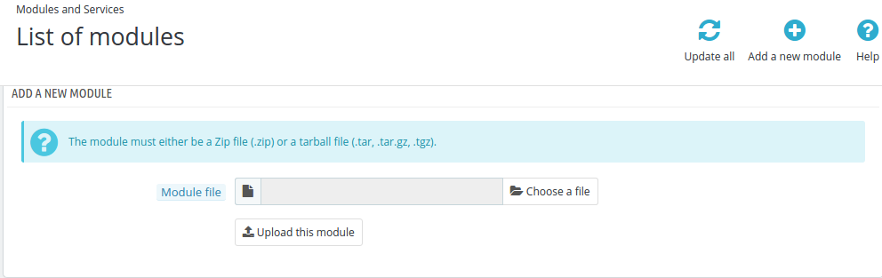
 
#### By FTP

You must have a file transfer software like "_FileZilla_" for example.

1. Open your software and connect to your FTP (SFTP).
2. Go to the root of your PrestaShop project.
3. Transfer the "_reverb_" source module in the "_/modules/_" folder.

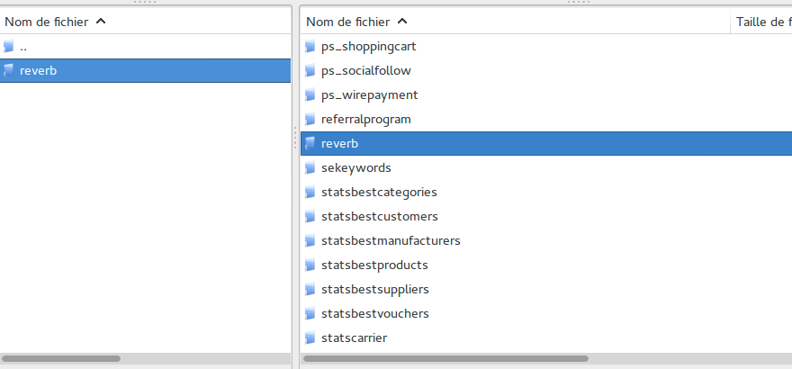

### How do you update the Reverb module ?

When Reverb updates the module on the addons of PrestaShop, you will be offered a module update in the list of modules in your PrestaShop Back Office.
Else via GitHub or downloading the ZIP file, apply the same methodology as the point "_By FTP_" or "_ZIP package_".

### Login with your Reverb account

You should connect the module with Reverb via a Token that you have previously generated on your Reverb space.

#### How to configure the Reverb module ?

Configure in PrestaShop 1.6 : _Modules & services > modules & services > Find the Reverb module > Configure_
Configure in PrestaShop 1.7 : _Modules > Modules & services > installed > Reverb > Configure_

#### Login

Select the sandbox mode or production and please enter your Reverb Token.

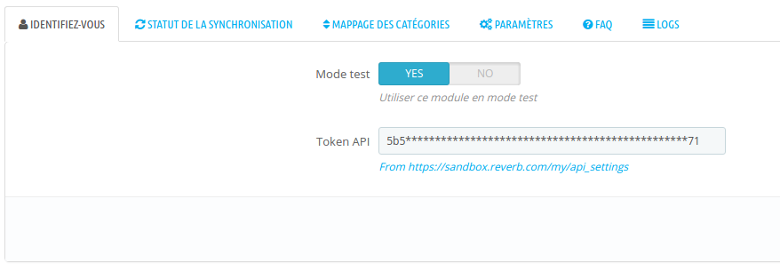

### Configure the settings

Configure the different rules in the product sync :

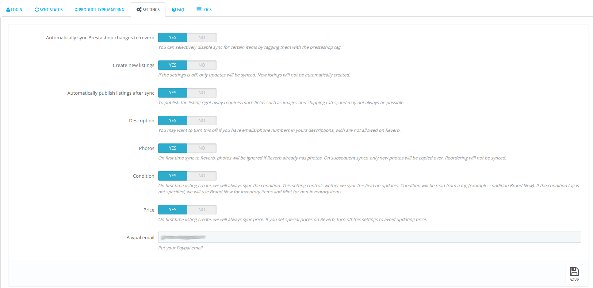

The field _PayPal Email_ can associate your PayPal account directly in Reverb.
Thus, the funds will transfert directly in your PayPal account.

### Configure the mapping categories 

The module proposes to associate the categories of your catalog with that of Reverb.
To do this, select one of your categories and map to a Reverb category.
Registration is automatic.

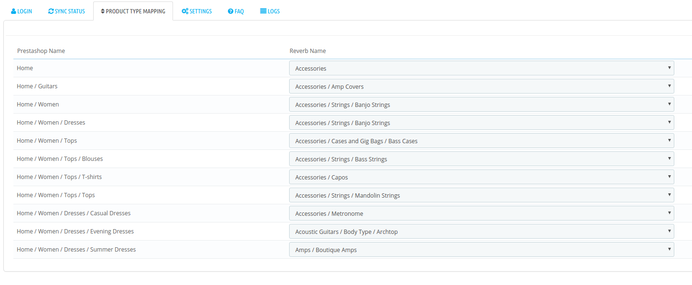

### Configure your products

In order to have products available for synchronization to Reverb, you must configure the products with information that Rerverb needs.

To access this configuration: Catalog > Products > Edit your product > Modules Tab > configure Reverb

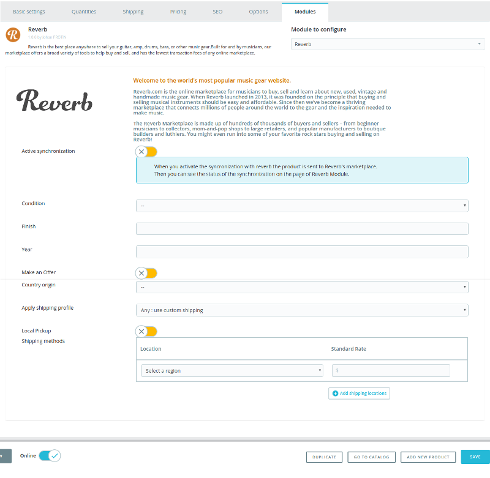

When the product is eligible for synchronization, your product will be available on the next screen _Product Synchronization Management_.

### Sync management of products

When you have configured your products in the PrestaShop catalog with the information necessary to be eligible for Reverb synchronization, you will be able to access the management of product synchronization manually or by CRON automatic task.

#### Manual management

You must access the "_Sync status_" tab to see the list of products awaiting synchronization, and see the history of the synchronizations in error or success.

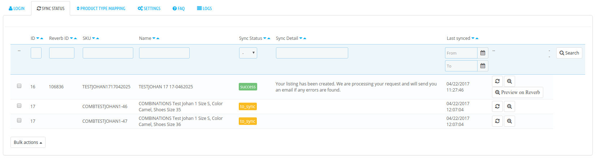

You have the possibility to launch some manual actions via these buttons:

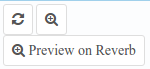

* First button: triggers synchronization for the selected product.
* Second button: redirects the merchant to the Front Office product page.
* Third button: redirects the merchant to the product directly on Reverb to edit it or check that it is published.

In addition to a manual and unit synchronization, it is possible to start a synchronization with a list of selected products by checking each line of the table and then clicking on the following action:

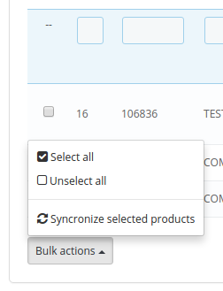

Reverb will return a response following the synchronization with a status error or success, and depending on this response the message of the response will be logged.

_Note: Product synchronization is only functional in one direction, from PrestaShop to Reverb, but not the reverse. Your PrestaShop catalog remains the main catalog._

#### Automatic management

To manage your CRON tasks on your hosting, we strongly advise you to ask your supplier to insert, modify a CRON task.

    */5 * * * * php [ROOT of the PrestaShop project]/modules/reverb/cron.php products > /var/log/cron.log

By default, this command launches every 5 minutes, so your site is constantly updated with your Reverb.com space.

For your tests it is possible to launch the cron in your browser [URL de votre site]/modules/reverb/cron.php?code=products 

### Gestion des synchronisation de vos commandes et stock

Pour pouvoir un fonctionnement optimal, nous vous conseillons de configurer une tâche CRON permettant de lancer en tâche de fond les synchronisations de commandes Reverb vers PrestaShop. Il faut vous renseigner auprès de votre hébergeur pour gérer l'insertion de la commande suivante :

    */8 * * * * php [Racine du Projet PrestaShop]/modules/reverb/cron.php orders > /var/log/cron.log

_il faut remplacer la valeur avec les crochets par le chemin de votre espace._

#### Un de vos produits a été vendu sur le site de Reverb.com ?

La tâche automatique qui tourne toutes les 8 minutes appelle Reverb.com pour récupérer toutes les commandes prêtes à être expédiées.
Elles sont ensuite contrôlées et créer dans votre PrestaShop, accessible dans _Commandes > Commandes_

Votre commande est créée avec un statut _Paiement accepté_, vous pouvez ensuite traiter votre commande depuis PrestaShop.

Lorsque vous mettez votre commande au statut "_expédiée_", PrestaShop proposera d'éditer dans le bloc _Shipping_ le _Tracking number_

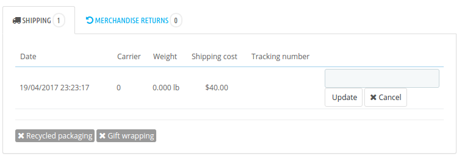

Vous pouvez visualiser le détail du paiement avec l'information d'où vient la transaction "_Reverb_" :

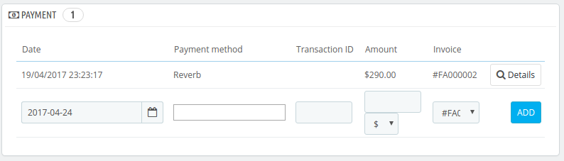

Dans le bloc message, le module Reverb historise quelques informations afin de pouvoir matcher entre PrestaShop et Reverb.com.

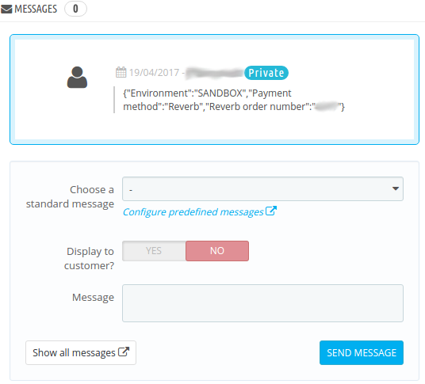

#### Un de vos produits a été vendu sur votre site PrestaShop ?

votre produit n'a pas été vendu sur Reverb.com mais sur votre site ecommerce. Au moment de la confirmation de la commande, le module Reverb envoit une notification à Reverb.com afin de mettre à jour le stock du produit. Seulement sur les produits ayant eu une synchronisation !

_Remarque :  Il se peut aussi que vous ayez déjà des produits sur le site Reverb.com mais dont les produits sur PrestaShop n'ont jamais été synchronisés. Si une commande est validée sur Reverb.com, le module enregistrera la commande sur PrestaShop en précisant dans un message de la commande que le produit n'est pas synchronisé et qu'il faut faire attention à cette commande._

### FAQ

#### What is Reverb?

Reverb is the largest and fastest growing community of musicians on the web. It's a one-stop resource that helps musicians learn about, compare, and find the gear that's right for them at a fair price, and a simple platform for private sellers and dealers to sell gear fast.Reverb is the journey and the destination.

#### How to connect to your Reverb.com account in the PrestaShop module?

You need to go to Reverb.com and log in to your seller account. Then you have to go into your account settings and access API & Integration.
Once the token is generated, you copy and paste it into the Login tab of the Reverb module. Validate your entry to log in.

#### How can Reverb recognize my product categories?

The Reverb module allows you to select your product category and associate it with a Reverb category. You must go to the Reverb module configuration and the Product type mapping tab.

#### And what if I've met the sync does't work?

* Control if the token is valid
* Control that each eligible product in Reverb is setup correctly
* Control the logs in Logs tab
* If the problem persist, contact the Reverb support