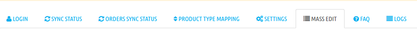
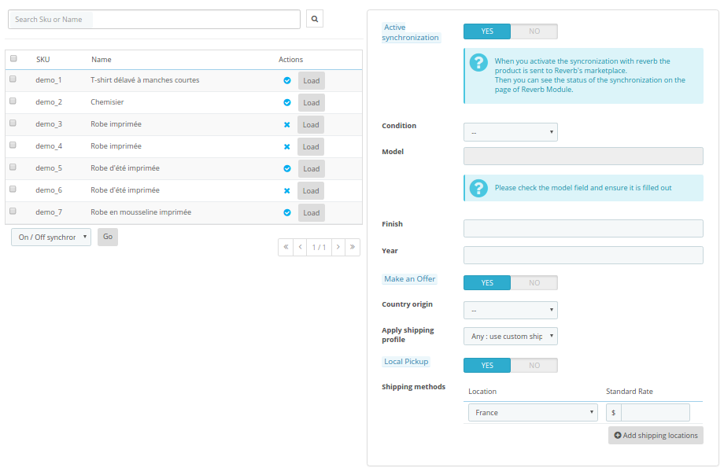
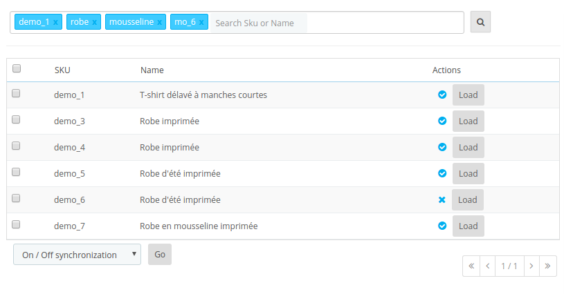

# Documentation for the Reverb module - PrestaShop 1.6 & 1.7

This documentation is a guide for the merchant to install and configure the module PrestaShop module.

## Summary

### You are developer

1. Prerequisites
2. Install your Develop environment 
3. Contribute in GitHub

### You are Merchant

1. Prerequisites
2. How to install the Reverb module in your PrestaShop ?
3. How do you update the Reverb module ?
4. Login with your Reverb account
5. Configure the settings
6. Configure the category mappings 
7. Configure your products
8. Sync management of products
9. Sync management of Orders and inventory
10. FAQ


## You are developer

### Prerequisites

To install your test environment with Docker, you need:

* Docker (https://docs.docker.com/engine/installation/)
* Docker Compose (https://docs.docker.com/compose/)

### Install your Develop environment

To launch a container with a PrestaShop, a database and an SMTP to receive emails, you must first configure the settings.
For PrestaShop 1.6, you need to edit the file /conf/env/PRESTASHOP-16.env
For PrestaShop 1.7, you need to edit the file /conf/env/PRESTASHOP-17.env


    ####################################
    ###     ENV SPECIFIC PRESTASHOP
    ####################################
    PS_DOMAIN=localhost:8016 
    DB_NAME=prestashop16
    DB_SERVER=mysql'

Caution: If you are launching the Reverb project with Docker for the first time, consider changing the environment variable PS_ERASE_DB = 0 to 1.
To change this variable, go to conf > env > PRESTASHOP.env
PS_ERASE_DB: Only with PS_INSTALL_AUTO=1. Drop and create the mysql database. All previous mysql data will be lost (default value: 0).

You can change the PS_DOMAIN variable with the domain name you want, we recommend in the local environment to stay on the localhost domain.


#### PrestaShop 1.6


    $ sh prestashop.sh init 16
    
You must wait a few minutes for the PrestaShop to install.

#### PrestaShop 1.7


    $ sh prestashop.sh init 17
    
You must wait a few minutes for the PrestaShop to install.

#### Links to access websites

**With the default configuration:**

* Front office PrestaShop 1.6: http://localhost:8016/
* Front office PrestaShop 1.7: http://localhost:8017/
* Back office PrestaShop 1.6: http://localhost:8016/admin-reverb
* Back office PrestaShop 1.7: http://localhost:8017/admin-reverb
* SMTP Mail Catcher: http://localhost:1082/

**To access the database, you must use software such as MySQL Workbench and connect with the following information:**

* Hostname: localhost
* Port: 3317
* Username: root
* Password: admin

### Contribute in GitHub

* Submit a PR with reasoning as to why the PR is needed

## You are a Merchant

### Prerequisites

* PrestaShop prerequisites: http://doc.prestashop.com/display/PS17/What+you+need+to+get+started
* Certificat SSL: your domain must be in HTTPS
* Token generated on your Reverb account: Reverb FAQ https://help.reverb.com/hc/en-us

### How install the Reverb module in your PrestaShop ?

#### PrestaShop Addons 

In the Back office of the PrestaShop, you can find the Reverb module in the list of the modules.
You can buy the module and install it.

#### ZIP package

Download the package in the PrestaShop addons.

To install it in your PrestaShop administrator back office:

* PrestaShop 1.7: click on "_Modules > Modules & services > Upload a module_".
* PrestaShop 1.6: click on "_Modules & services > Modules & services > Add a new module_".

Choose the package and click on "_Upload this module_".


 
#### By FTP

You must have a file transfer software like "_FileZilla_" for example.

1. Open your software and connect to your FTP (SFTP).
2. Go to the root of your PrestaShop project.
3. Transfer the "_reverb_" source module in the "_/modules/_" folder.


### How do you update the Reverb module ?

When Reverb updates the module on the addons of PrestaShop, you will be offered a module update in the list of modules in your PrestaShop Back Office.
Else via GitHub or downloading the ZIP file, apply the same methodology as the point "_By FTP_" or "_ZIP package_".

### Login with your Reverb account

You should connect the module with Reverb via a Token that you have previously generated on your Reverb account.

#### How to configure the Reverb module ?

Configure in PrestaShop 1.6 : _Modules & services > modules & services > Find the Reverb module > Configure_
Configure in PrestaShop 1.7 : _Modules > Modules & services > installed > Reverb > Configure_

#### Login

Select the sandbox mode or production and please enter your Reverb Token.


### Configure the settings

Configure the different rules in the product sync :


### Configure the category mappings 

You need to associate the categories of your catalog with that of Reverb.
To do this, select one of your categories and map to a Reverb category.
Registration is automatic.


### Configure your products

#### Standard method through the product details

In order to have products available for synchronization to Reverb, you must configure the products with information that Rerverb needs.

To access this configuration: Catalog > Products > Edit your product > Modules Tab > configure Reverb


When the product is eligible for synchronization, your product will be available on the next screen _Product Synchronization Management_.

** Note **: the field Model is mandatory for the Reverb API. If not given, the Reverb API returned an error message.

#### Mass-Editing

The module can to mass-edit Reverb information because for some merchants, the product catalog is too large to use the standard method.

To start with the Mass-Edit, go to the the tab " Mass-Edit ":



The screen appears on 2 columns.



##### Description of the first column:

The field "search Sku or Name", allows searching with precision with tags, example:



Note that on tags we do not have SKUs or Product name in full, it is possible to put only a small part of the SKU or name in order to retrieve a list of all the products starting with XXXX for example.

Possible actions on the first part of this screen:

| Field                  | description                                                                                                     |
|------------------------|:---------------------------------------------------------------------------------------------------------------:|
| Search Sku or name     |  This field allows you to search for one or more products that you want to edit in bulk                         |
| Actions                |  Activate / deactivate synchronization and button for loading product info in the form on the right             |
| On/Off Synchronization |  Enable / disable synchronization for products selected in the results table                                    |
| On/Off make an offer   |  Enable / Disable the option to make an offer for selected products in the results table                        |
| On/Off local pickup    |  Enable / Disable the shipping local pickup for Products Selected in the Results Table                          |
| Edit products in bulk  |  Loads the list of selected products and on the entry of the form on the right this saves in mass               |

##### Description of the second column:

The form is just the same as for the product details.

When the product is loaded alone, the "Model" field can be customized; if you make an edition greater than 1 product then this field will be read-only. Upon registration, the system will retrieve the product name and assign it for product synchronization.

### Sync management of products

When you have configured your products in the PrestaShop catalog with the information necessary to be eligible for Reverb synchronization, you will be able to access the management of product synchronization manually or by CRON automatic task.

#### Manual management

You must access the "_Sync status_" tab to see the list of products awaiting synchronization, and see the history of the synchronizations in error or success.


You have the possibility to launch some manual actions via these buttons:


* First button: triggers synchronization for the selected product.
* Second button: redirects the merchant to the Front Office product page.
* Third button: redirects the merchant to the product directly on Reverb to edit it or check that it is published.

In addition to a manual and unit synchronization, it is possible to start a synchronization with a list of selected products by checking each line of the table and then clicking on the following action:


Reverb will return a response following the synchronization with a status error or success, and depending on this response the message of the response will be logged.

_Note: Product synchronization is only functional in one direction, from PrestaShop to Reverb, but not the reverse. Your PrestaShop catalog remains the main catalog._

#### Automatic management

To manage your CRON tasks on your hosting, we strongly advise you to ask your host to insert or modify a CRON task.

    */5 * * * * php [ROOT of the PrestaShop project]/modules/reverb/cron.php products > /var/log/cron.log

By default, this command launches every 5 minutes, so your site is constantly updated with your Reverb.com space.

For your tests it is possible to launch the cron in your browser [URL de votre site]/modules/reverb/cron.php?code=products

##### How to configure your Reverb module with your OVH hosting

OVH has a restrictive configuration on their shared hosting CRON. The URLs to be added must not contain parameters (key = value).

We propose a configuration that adapts to the functioning of OVH:

1. Copy / paste the 3 PHP files into reverb/doc/cron-for-ovh/ to the root of the Reverb module
2. Open each file and replace the **[ADD YOUR DOMAIN URL]** tag with the URL of your site

```php
<?php
// Get cURL resource
$curl = curl_init();
// Set some options - we are passing in a useragent too here
curl_setopt_array(
    $curl,
    array(
        CURLOPT_RETURNTRANSFER => 1,
        CURLOPT_URL => '[ADD YOUR DOMAIN URL]/modules/reverb/cron.php?code=orders',
        CURLOPT_USERAGENT => 'CRON OVH'
    )
);
// Send the request & save response to $resp
$resp = curl_exec($curl);
// Close request to clear up some resources
curl_close($curl);
```


3. Register each file
4. Set up the CRON OVH system with the following URLs:
  * [Your Domain URL]/modules/reverb/cron-sync-orders.php (automated calling every hour)
  * [Your Domain URL]/modules/reverb/cron-sync-product.php (automated calling every hour)
  * [Your Domain URL]/modules/reverb/cron-sync-reconciliation.php (automated calling every day)

Now your CRON system on OVH is ready for optimal operation of your automated tasks between Reverb and your PrestaShop.

OVH source: http://docs.ovh.com/fr/fr/web/hosting/mutualise-taches-automatisees-cron/

### Managing your order and stock synchronization

For optimum performance, we recommend that you configure a CRON task to run Reverb to PrestaShop command synchronizations in the background. You must check with your host to manage the insertion of the following command:

    */8 * * * * php [Racine du Projet PrestaShop]/modules/reverb/cron.php orders > /var/log/cron.log

_you must replace the value with the square brackets by the path of your space._

#### One of your products has been sold on Reverb.com

The automatic task that runs every 8 minutes calls Reverb.com to retrieve all orders ready to be shipped.
They are then checked and created in your PrestaShop, accessible in _Commands> Commands_

! [list orders] (img / list-en-order.png)

Your order is created with a status _Payment accepted_, you can then process your order from PrestaShop.

When you put your command to the "dispatched" status, PrestaShop will propose to edit in the _Shipping_ block the _Tracking number_

[list orders] (img / order-shipping.png)

You can view the details of the payment with the information from where the transaction "_Reverb_" comes from:

! [list orders] (img / order-payment.png)

In the message block, the Reverb module logs some information so that it can match between PrestaShop and Reverb.com.

! [list orders] (img / order-message.png)

#### One of your products has sold on your PrestaShop site?

Your product was not sold on Reverb.com but on your ecommerce site. Upon confirmation of the order, the Reverb module sends a notification to Reverb.com to update the stock of the product. Only on products that are ready for synchronization!

_Note: You may also already have products on the Reverb.com site but whose products on PrestaShop have never been synchronized. If a command is validated on Reverb.com, the module will save the command to PrestaShop by specifying in a message of the command that the product is not synchronized and that you must pay attention to this command._

### FAQ

#### What is Reverb?

Reverb is the largest and fastest growing community of musicians on the web. It's a one-stop resource that helps musicians learn about, compare, and find the gear that's right for them at a fair price, and a simple platform for private sellers and dealers to sell gear fast.Reverb is the journey and the destination.

#### How to connect to your Reverb.com account in the PrestaShop module?

You need to go to Reverb.com and log in to your seller account. Then you have to go into your account settings and access API & Integration.
Once the token is generated, you copy and paste it into the Login tab of the Reverb module. Validate your entry to log in.

#### How can Reverb recognize my product categories?

The Reverb module allows you to select your product category and associate it with a Reverb category. You must go to the Reverb module configuration and the Product type mapping tab.

#### And what if I've met the sync does't work?

* Control if the token is valid
* Control that each eligible product in Reverb is setup correctly
* Control the logs in Logs tab
* If the problem persist, contact the Reverb support (https://reverb.com/fr/page/contact)
