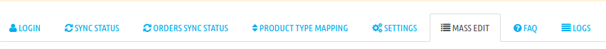
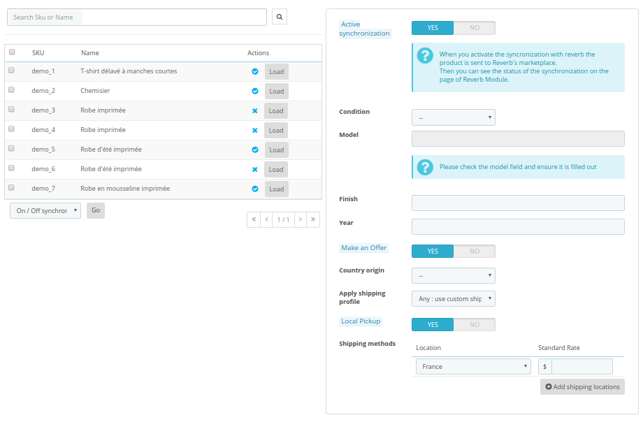
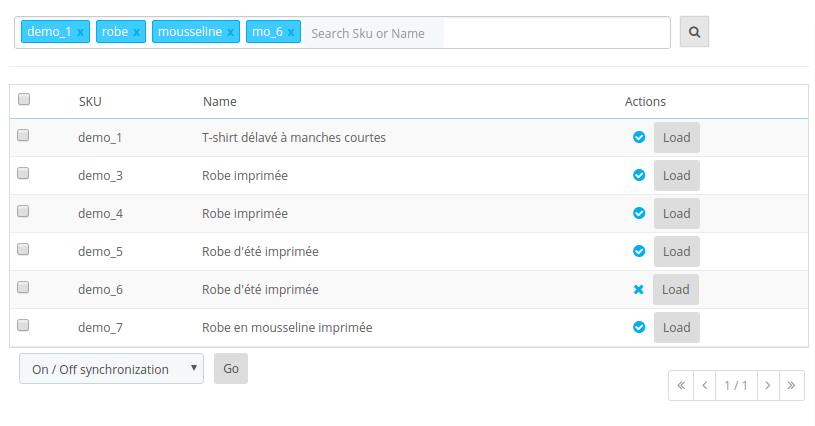
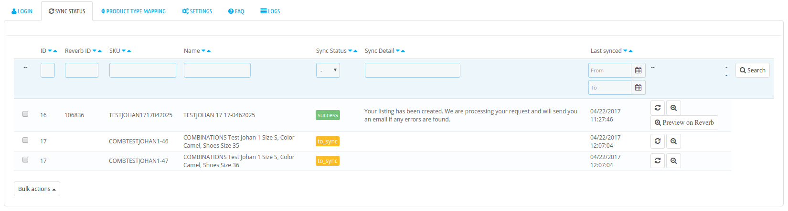
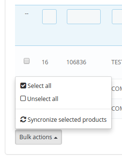
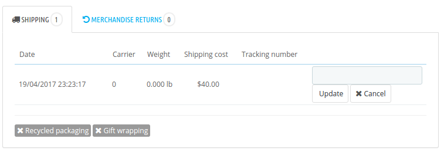
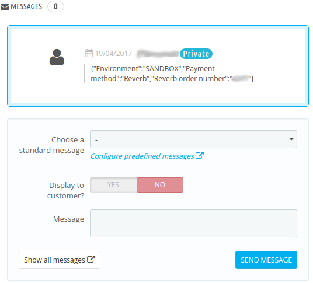

# Documentation du module Reverb - PrestaShop 1.6 & 1.7

Cette documentation a pour but d'aider le marchand à installer puis configurer le module Reverb sur PrestaShop.

## Sommaire

### Vous êtes développeur ?

1. Pré-requis
2. Installer votre environement de développement 
3. Comment contribuer sur GitHub ?

### Vous êtes marchand ?

1. Pré-requis
2. Comment installer le module Reverb sur votre PrestaShop ?
3. Comment mettre à jour votre module Reverb ?
4. Connexion avec votre compte Reverb
5. Configurer les paramètres
6. Configurer le mapping des catégories 
7. Configurer vos produits
8. Gestion des synchronisations de vos produits
9. Gestion des synchronisation de vos commandes et stock
10. FAQ


## Vous êtes développeur ?

### Pré-requis

Pour installer votre environement de test avec Docker, il vous faut :

* Docker (https://docs.docker.com/engine/installation/)
* Docker Compose (https://docs.docker.com/compose/)

### Installer votre environement de développement

Pour lancer un container avec un PrestaShop, une base données et un smtp pour recevoir les emails, il faut tout d'abord configurer les paramètres.
Pour PrestaShop 1.6, il faut éditer le fichier /conf/env/PRESTASHOP-16.env
Pour PrestaShop 1.7, il faut éditer le fichier /conf/env/PRESTASHOP-17.env


    ####################################
    ###     ENV SPECIFIC PRESTASHOP
    ####################################
    PS_DOMAIN=localhost:8016 
    DB_NAME=prestashop16
    DB_SERVER=mysql'

Attention:
Si vous lancez le projet Reverb avec Docker pour la première fois, pensez à modifier la variable d'environnement PS_ERASE_DB=0 à 1.
To change this variable, go to conf > env > PRESTASHOP.env
PS_ERASE_DB: Seulement avec PS_INSTALL_AUTO = 1. Déposez et créez la base de données mysql. Toutes les données mysql précédentes seront perdues (valeur par défaut: 0).

Vous pouvez modifier la variable PS_DOMAIN avec le nom de domaine que vous souhaitez, nous recommandons en local de rester sur le domaine localhost.


#### PrestaShop 1.6


    $ sh prestashop.sh init 16
    
Vous devez attendre quelques minutes pour que PrestaShop s'installe correctement.

#### PrestaShop 1.7


    $ sh prestashop.sh init 17
    
Vous devez attendre quelques minutes pour que PrestaShop s'installe correctement.

#### Liens pour accéder aux sites

Avec la configuration par défaut:

* Front office PrestaShop 1.6: http://localhost:8016/
* Front office PrestaShop 1.7: http://localhost:8017/
* Back office PrestaShop 1.6: http://localhost:8016/admin-reverb
* Back office PrestaShop 1.7: http://localhost:8017/admin-reverb
* SMTP Mail Catcher: http://localhost:1082/

Pour accéder à la base de données, vous devez utiliser un logiciel comme MySQL Workbench et vous connectez avec les informations suivantes :

* Hostname: localhost
* Port: 3317
* Username: root
* Password: admin

### Contribuer sur GitHub

**[ Reverb must be write his rules ]**

## Vous êtes marchand ?

### Pré-requis

* PrestaShop pré-requis : http://doc.prestashop.com/display/PS17/What+you+need+to+get+started
* Certificat SSL: votre domaine doit être en HTTPS
* Un token généré sur votre compte : FAQ Reverb sur https://help.reverb.com/hc/fr

### Comment installer le module Reverb sur votre PrestaShop ?

#### Addons de PrestaShop

Dans le Back office de PrestaShop, vous pouvez trouver le module Reverb dans la liste des modules.
Vous pouvez acheter le module et l'installer.

#### Fichier ZIP

Télécharger le fichier ZIP via votre compte PrestaShop sur l'addons.

Pour installer le module Reverb via le panel d'administration de votre PrestaShop: 

* PrestaShop 1.7: cliquez sur "_Modules > Modules & services > Importer un module_".
* PrestaShop 1.6: cliquez sur "_Modules & services > Modules & services > Ajouter un nouveau module_".

Choisissez votre fichier ZIP et cliquez sur "_Importer ce module_"


 
#### Par FTP

Vous devez avoir une logiciel de transfert de fichier comme "_FileZilla_" par exemple.

1. Ouvrez votre logiciel et connectez vous sur votre FTP (SFTP).
2. Allez à la racine de votre projet PrestaShop.
3. Transéfer les sources du module "_reverb_" le répertoire "_/modules/_".


### Comment mettre à jour votre module Reverb ?

Lorsque Reverb mettra à jour le module sur l'addons de PrestaShop, il vous sera proposé dans la liste des modules dans votre Back offcie PrestaShop une mise à jour du module.
Sinon par l'intermédiaire de GitHub ou le téléchargement du fichier ZIP, d'appliquer la même méthodologie que le point "_Par FTP_" ou "_Fichier ZIP_".


### Connexion avec votre compte Reverb

Vous devez connecter le module avec Reverb par l'intermédiaire d'un Token que vous avez au préalable généré sur votre espace Reverb.

#### Comment configurer le module Reverb

Pour configurer sur PrestaShop 1.6 : _Modules & services > modules & services > Trouver le module Reverb > Configure_
Pour configurer sur PrestaShop 1.7 : _Modules > Modules & services > installed > Reverb > Configure_

#### Connexion

Sélectionnez le mode de fonctionnement test ou production puis saisir votre token Reverb.


### Configurer les paramètres

Configurer les différentes règles sur la synchronisation des produits :


### Configurer le mapping des catégories 

Le module propose d'associer les catégories de votre catalogue avec celle de Reverb.
Pour ceci, il faut sélectionner une de vos catégories et mapper avec une catégorie Reverb.
L'enregistrement est automatique.


### Configurer vos produits

#### Méthode standard via la fiche produit

Afin d'avoir des produits disponible pour la synchronisation vers Reverb, vous devez configurer les produits avec des informations dont Rerverb à besoin.

Pour accéder à cette configuration : Catalog > Products > Edit your product > Modules Tab > configure Reverb


Lorsque le produit est éligible à la synchronisation, votre produit sera disponible sur le prochain écran _Gestion des synchronisations de vos produits_.

** Attention **: Le champ 'Model' est obligatoire pour l'API de Reverb, s'il n'est pas renseigné, Reverb retourne une message d'erreur pour le produit.

#### Méthode d'édition de masse

Le module aidera à traiter en masse l'édition des informations Reverb car pour certains marchands, le catalogue produit est trop gros pour utiliser la méthode standard.

Pour démarrer avec l'édition de masse, nous vous invitons à accéder à l'onglet " Mass-Edit ":



L'écran se présente sur 2 colonnes.



##### Description de la première colonne:

Le champ "search Sku or Name" permet d'affiner sa recherche avec précision avec des tags, exemple:



On remarque que sur les tags nous n'avons pas des SKUs ou Nom de produit en entier, il est possible de mettre qu'une petite partie du SKU ou du nom afin de récupérer une liste de tous les produits commençant par XXXX par exemple.

Voici un tableau explicatif des actions possible sur la première partie de cet écran:

| Champs                 | description                                                                                                     |
|------------------------|:----------------------------------------------------------------------------------------------------------------|
| Search Sku or name     |  Ce champ vous permet de rechercher un ou plusieurs produits dont vous voulez éditer en masse                   |
| Actions                |  Activer / Désactiver la synchronization et bouton de chargement des infos produits dans le formulaire à droite |
| On/Off Synchronization |  Activer / Désactiver la synchronization pour les produits sélectionnés dans le tableau des résultats           |
| On/Off make an offer   |  Activer / Désactiver l'option de faire une offre pour les produits sélectionnés dans le tableau des résultats  |
| On/Off local pickup    |  Activer / Désactiver le retrait sur place pour les produits sélectionnés dans le tableau des résultats         |
| Edit products in bulk  |  Charge la liste des produits sélectionnés et sur la saisie du formulaire à droite cela enregistre en masse     |

##### Description de la deuxième colonne:

Le formulaire est identique à celui de la fiche produit.

Lorsque le produit est chargé seul, le champ "Model" est personnalisable par contre si l'on fait une édition supérieur à 1 produit alors ce champ sera en lecture seul.
A l'enregistrement, le système récupérera le nom du produit et lui affectera pour la synchronisation du produit.

### Gestion des synchronisations de vos produits

Lorsque vous avez configuré vos produits du catalogue PrestaShop avec les informations nécessaire pour être éligible à la synchronisation Reverb, vous pourrez accéder la gestion de la synchronisation de produits manuellement ou par tâche automatique CRON.

#### Gestion manuelle

Il faut accéder dans l'onglet "_Sync status_" pour voir la liste des produits en attente de synchronisation, mais aussi voir l'historique des synchronisations en erreur ou succès.



Il vous est possible de lancer quelques actions manuelles via ces boutons :


* Premier bouton : déclenche la synchronisation pour le produit sélectionné.
* Deuxième bouton : redirige le marchand vers la page produit en Front Office du site PrestaShop.
* Troisième bouton : redirige le marchand vers le produit directement sur Reverb pour l'editer ou vérifier qu'il est publié.

En plus de faire une synchronisation manuelle et unitaire, il est possible de lancer une synchronisation avec une liste de produits sélectionnés en cochant cahque ligne du tableau puis en cliquant sur l'action suivante :



Reverb vous retournera un réponse suite à la synchronisation avec un statut _erreur_ ou _succès_ et en fonction de cette réponse il sera historisé le message de la réponse.

_Remarque : la synchronisation de produit n'est fonctionnelle que dans un seul sens, de PrestaShop vers Reverb mais pas l'inverse. Votre catalogue PrestaShop reste donc le catalogue principal._

#### Gestion automatique

Pour la gestion de vos tâches CRON sur votre hébergement, nous vous conseillons vivement de vous renseigner auprès de votre hébergeur pour insérer, modifier une tâche CRON.

    */5 * * * * php [Racine du Projet PrestaShop]/modules/reverb/cron.php products > /var/log/cron.log

_il faut remplacer la valeur avec les crochets par le chemin de votre espace._

Par défaut, cette commande se lance toutes les 5 minutes, ainsi cela permet à votre site d'être à jour en permanence avec votre espace Reverb.com.

Pour vos tests il est possible de lancer le cron dans votre navigateur [URL de votre site]/modules/reverb/cron.php?code=products 

### Gestion des synchronisations de vos commandes et stock

Pour avoir un fonctionnement optimal, nous vous conseillons de configurer une tâche CRON permettant de lancer en tâche de fond les synchronisations de commandes Reverb vers PrestaShop. Il faut vous renseigner auprès de votre hébergeur pour gérer l'insertion de la commande suivante :

    */8 * * * * php [Racine du Projet PrestaShop]/modules/reverb/cron.php orders > /var/log/cron.log

_il faut remplacer la valeur avec les crochets par le chemin de votre espace._

##### Comment configurer votre module avec l'hébergeur OVH ?

OVH a un configuration restrictive sur leur hébergement mutualisé pour le système de CRON. Les URLs qui doivent être ajoutée ne doivent pas contenir de paramètres (clé=valeur).

Nous proposons une configuration qui s'adapte au fonctionnement d'OVH:

1. Copier / coller les 3 fichiers PHP dans reverb/doc/cron-for-ovh/ vers la racine du module Reverb
2. Ouvrez chaque fichier et remplacer le tag [ADD YOUR DOMAIN URL] par l'url de votre site

```php
<?php
// Get cURL resource
$curl = curl_init();
// Set some options - we are passing in a useragent too here
curl_setopt_array(
    $curl,
    array(
        CURLOPT_RETURNTRANSFER => 1,
        CURLOPT_URL => '[ADD YOUR DOMAIN URL]/modules/reverb/cron.php?code=orders',
        CURLOPT_USERAGENT => 'CRON OVH'
    )
);
// Send the request & save response to $resp
$resp = curl_exec($curl);
// Close request to clear up some resources
curl_close($curl);
```


3. Enregistrer chaque fichier
4. Paramétrer le système de CRON OVH avec les URLS suivantes:
  * [VOTRE DOMAINE URL]/modules/reverb/cron-sync-orders.php (appel automatisé toutes les heures)
  * [VOTRE DOMAINE URL]/modules/reverb/cron-sync-product.php (appel automatisé toutes les heures)
  * [VOTRE DOMAINE URL]/modules/reverb/cron-sync-reconciliation.php (appel automatisé une fois par jour)

Maintenant votre système de CRON sur OVH est prêt pour un fonctionnement optimal de vos tâches automatisés entre Reverb et votre site PrestaShop.

#### Un de vos produits a été vendu sur le site de Reverb.com ?

La tâche automatique qui tourne toutes les 8 minutes appelle Reverb.com pour récupérer toutes les commandes prêtes à être expédiées.
Elles sont ensuite contrôlées et créer dans votre PrestaShop, accessible dans _Commandes > Commandes_


Votre commande est créée avec un statut _Paiement accepté_, vous pouvez ensuite traiter votre commande depuis PrestaShop.

Lorsque vous mettez votre commande au statut "_expédiée_", PrestaShop proposera d'éditer dans le bloc _Shipping_ le _Tracking number_



Vous pouvez visualiser le détail du paiement avec l'information d'où vient la transaction "_Reverb_" :


Dans le bloc message, le module Reverb historise quelques informations afin de pouvoir matcher entre PrestaShop et Reverb.com.



#### Un de vos produits a été vendu sur votre site PrestaShop ?

votre produit n'a pas été vendu sur Reverb.com mais sur votre site ecommerce. Au moment de la confirmation de la commande, le module Reverb envoit une notification à Reverb.com afin de mettre à jour le stock du produit. Seulement sur les produits ayant eu une synchronisation !

_Remarque :  Il se peut aussi que vous ayez déjà des produits sur le site Reverb.com mais dont les produits sur PrestaShop n'ont jamais été synchronisés. Si une commande est validée sur Reverb.com, le module enregistrera la commande sur PrestaShop en précisant dans un message de la commande que le produit n'est pas synchronisé et qu'il faut faire attention à cette commande._

### FAQ

#### Qu’est-ce que Reverb ?

Reverb est la communauté de musiciens la plus importante et à la croissance la plus rapide sur le net. C’est une ressource unique qui permet aux musiciens d’apprendre, de comparer et de trouver le bon matériel au meilleur prix ainsi qu’une plateforme simple où les vendeurs privés et les magasins de musique peuvent vendre rapidement leur matériel. Reverb est à la fois un voyage et une destination.

#### Comment se connecter à son compte Reverb.com dans le module PrestaShop ?

Vous devez aller sur le site Reverb.com et vous connectez à votre compte vendeur. Ensuite il faut aller dans les paramètres de votre compte et accéder à API & Integration.
Une fois le token généré, vous faites un copier/coller dans l'onglet de connexion du module Reverb.Valider votre saisit pour vous connectez.

#### Comment Reverb.com peut reconnaître mes catégories de produit ?

Le module de Reverb permet de sélectionner votre catégorie de produit et l'associer à une catégorie Reverb. Il faut se rendre dans la configuration du module Reverb et l'onglet Product type mapping.

#### Et si la synchronisation ne fonctionne pas ?

* Vérifier si le token de connexion est valide
* Vérifier que chaque produit éligible à Reverb est bien paramétrés
* Vérifier les logs dans l'onglet logs
* si le problème persiste, veuillez contacter le support de Reverb (https://reverb.com/fr/page/contact)